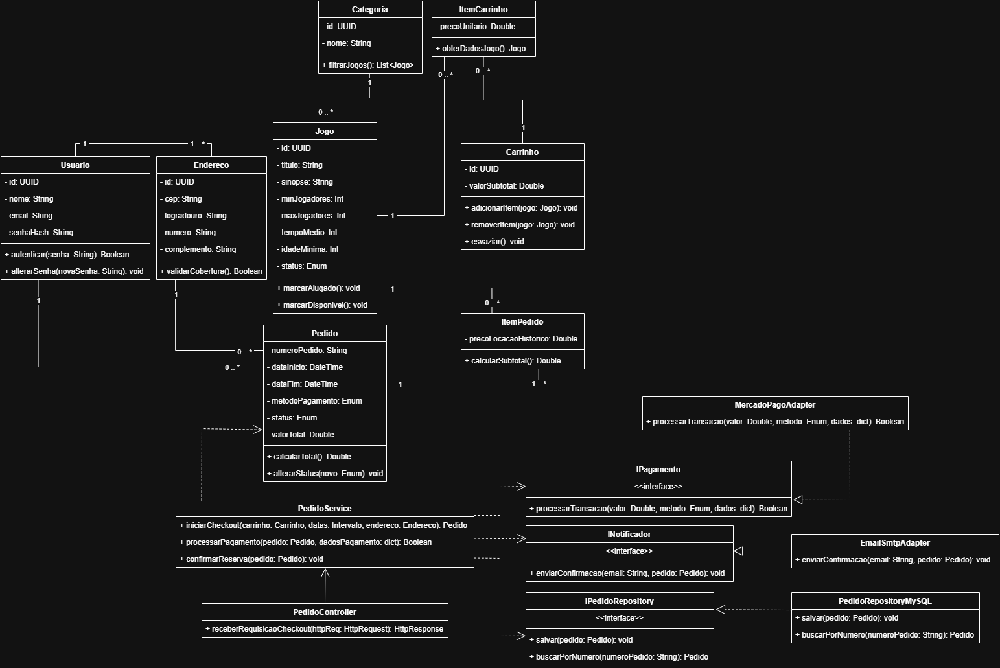

# Análise dos Requisitos e Identificação das Classes - Doutor Ludo

## 1. Análise dos Requisitos

### 1.1 Requisitos Não Funcionais
Abaixo estão os critérios de qualidade e restrições técnicas que o sistema deve atender.

| Categoria | Descrição |
| :--- | :--- |
| **Desempenho** | O catálogo de jogos (página principal) deve ter um tempo de carregamento completo inferior a 3 segundos. |
| **Segurança** | As senhas não devem ser armazenadas em texto plano. É obrigatório o uso de um algoritmo de hashing. |
| **Compatibilidade** | A aplicação web deve ser funcional e responsiva nas duas versões mais recentes dos navegadores: Chrome, Firefox, Safari (desktop/iOS) e Chrome Mobile (Android). |
| **Usabilidade** | Um usuário novo deve conseguir se cadastrar na plataforma em menos de 2 minutos. |
| **Confiabilidade** | A aplicação deve manter uma disponibilidade de 99,5% durante o primeiro mês de operação. |

### 1.2 Requisitos Funcionais
Os requisitos funcionais estão agrupados por módulos baseados nas histórias de usuário do projeto.

| Módulo | ID | Descrição do Requisito |
| :--- | :--- | :--- |
| **1. Cadastro e Login** | H1.1 | Realizar cadastro de usuário informando dados básicos. |
| | H1.2 | Realizar login na área de usuário utilizando credenciais válidas. |
| | H1.3 | Visualizar mensagens de erro em caso de falha na autenticação. |
| | H1.4 | Solicitar recuperação de senha através do e-mail cadastrado. |
| **2. Catálogo de Jogos** | H2.1 | Visualizar a listagem completa dos jogos disponíveis no acervo. |
| | H2.2 | Visualizar a imagem da capa e o nome de cada jogo nos cards. |
| | H2.3 | Visualizar o status de disponibilidade (alugado/disponível) na listagem. |
| | H2.4 | Acessar a tela de detalhes de um jogo ao clicar em seu respectivo card. |
| **3. Busca e Filtro** | H3.1 | Realizar busca textual filtrando os jogos pelo nome. |
| | H3.2 | Filtrar a listagem de jogos por categorias específicas. |
| | H3.3 | Filtrar os jogos baseando-se na quantidade de jogadores suportada. |
| | H3.4 | Limpar os filtros aplicados e retornar à listagem original. |
| **4. Detalhamento** | H4.1 | Visualizar a descrição, sinopse e fichas técnicas (idade, tempo) do jogo. |
| | H4.2 | Visualizar a galeria de fotos do tabuleiro e de seus componentes. |
| | H4.3 | Acessar o manual de regras em PDF ou vídeos explicativos da WikiLudo. |
| | H4.4 | Adicionar o jogo visualizado ao carrinho de locação. |
| **5. Carrinho** | H5.1 | Visualizar a lista completa de itens adicionados ao carrinho. |
| | H5.2 | Remover itens indesejados do carrinho de locação. |
| | H5.3 | Visualizar o cálculo do subtotal do pedido em tempo real. |
| | H5.4 | Prosseguir para a etapa de definição de datas do aluguel. |
| **6. Período de Locação** | H6.1 | Selecionar a data de início da locação através de um calendário. |
| | H6.2 | Selecionar a data de devolução dos jogos. |
| | H6.3 | Visualizar o valor total da locação atualizado dinamicamente conforme os dias escolhidos. |
| | H6.4 | Confirmar as datas da locação e avançar no fluxo. |
| **7. Checkout e Pagamento** | H7.1 | Escolher o método de pagamento desejado (Cartão de Crédito ou PIX). |
| | H7.2 | Inserir de forma segura e validar os dados do cartão de crédito. |
| | H7.3 | Processar o pagamento e efetivar a transação. |
| | H7.4 | Visualizar a confirmação do pedido e receber o comprovante via e-mail. |
| **8. Logística** | H8.1 | Cadastrar um novo endereço ou confirmar o endereço de entrega salvo. |
| | H8.2 | Selecionar a janela de horário para a entrega dos jogos. |
| | H8.3 | Selecionar o horário para a coleta (devolução) dos jogos. |
| | H8.4 | Confirmar e registrar os dados de logística no sistema. |

## 2. Identificação das Classes

A estrutura do sistema foi refatorada para aderir à Arquitetura Hexagonal, garantindo o isolamento das regras de negócio (Domínio) das tecnologias externas (Adaptadores).

### 2.1 Camada de Domínio
Contém as entidades puras e os serviços que orquestram as regras de negócio.

#### Entidade: Usuario
| Atributo | Tipo | Descrição |
| :--- | :--- | :--- |
| `id` | UUID | Identificador único do usuário. |
| `nome` | String | Nome completo. |
| `email` | String | E-mail de acesso. |
| `senhaHash` | String | Senha criptografada. |
| `enderecos` | List<Endereco> | Lista de endereços vinculados ao perfil do usuário. |
| **Método** | **Retorno** | **Descrição** |
| `autenticar(senha)` | Boolean | Valida a senha informada com o hash salvo. |
| `alterarSenha(novaSenha)` | void | Atualiza o hash da senha. |

#### Entidade: Endereco
| Atributo | Tipo | Descrição |
| :--- | :--- | :--- |
| `id` | UUID | Identificador único do endereço. |
| `cep` | String | Código Postal. |
| `logradouro` | String | Rua ou Avenida. |
| `numero` | String | Número da residência. |
| `complemento` | String | Informações adicionais (opcional). |
| **Método** | **Retorno** | **Descrição** |
| `validarCobertura()` | Boolean | Verifica se o CEP pertence à área de entrega. |

#### Entidade: Categoria
| Atributo | Tipo | Descrição |
| :--- | :--- | :--- |
| `id` | UUID | Identificador da categoria. |
| `nome` | String | Nome (ex: Estratégia, Party Games). |
| `jogos` | List<Jogo> | Lista de jogos que pertencem a esta categoria. |
| **Método** | **Retorno** | **Descrição** |
| `filtrarJogos()` | List<Jogo> | Retorna os jogos vinculados a esta categoria. |

#### Entidade: Jogo
| Atributo | Tipo | Descrição |
| :--- | :--- | :--- |
| `id` | UUID | Identificador único do jogo. |
| `titulo` | String | Nome do jogo. |
| `sinopse` | String | Descrição textual do jogo. |
| `categoria` | Categoria | Referência à categoria do jogo. |
| `minJogadores` | Integer | Quantidade mínima de jogadores. |
| `maxJogadores` | Integer | Quantidade máxima de jogadores. |
| `tempoMedio` | Integer | Tempo médio de partida em minutos. |
| `idadeMinima` | Integer | Idade mínima recomendada. |
| `status` | Enum | Disponível, Alugado, ou Manutenção. |
| **Método** | **Retorno** | **Descrição** |
| `marcarAlugado()` | void | Altera o status do jogo para Alugado. |
| `marcarDisponivel()`| void | Altera o status do jogo para Disponível. |

#### Entidade: ItemCarrinho
| Atributo | Tipo | Descrição |
| :--- | :--- | :--- |
| `jogo` | Jogo | Referência ao jogo selecionado. |
| `precoUnitario` | Double | Valor da locação do jogo no momento. |
| **Método** | **Retorno** | **Descrição** |
| `obterDadosJogo()` | Jogo | Retorna os detalhes do jogo vinculado. |

#### Entidade: Carrinho
| Atributo | Tipo | Descrição |
| :--- | :--- | :--- |
| `id` | UUID | Identificador da sessão do carrinho. |
| `itens` | List<ItemCarrinho> | Lista de jogos selecionados. |
| `valorSubtotal` | Double | Soma do valor dos itens. |
| **Método** | **Retorno** | **Descrição** |
| `adicionarItem(jogo)` | void | Adiciona um jogo e recalcula o subtotal. |
| `removerItem(jogo)` | void | Remove um jogo e recalcula o subtotal. |
| `esvaziar()` | void | Limpa a lista de itens. |

#### Entidade: ItemPedido
| Atributo | Tipo | Descrição |
| :--- | :--- | :--- |
| `jogo` | Jogo | Referência ao jogo efetivamente alugado. |
| `precoLocacaoHistorico`| Double | Preço unitário travado no momento da locação. |
| **Método** | **Retorno** | **Descrição** |
| `calcularSubtotal()` | Double | Calcula preço do item considerando os dias. |

#### Entidade: Pedido
| Atributo | Tipo | Descrição |
| :--- | :--- | :--- |
| `numeroPedido` | String | Código rastreável do pedido. |
| `usuario` | Usuario | Cliente que realizou o aluguel. |
| `enderecoEntrega`| Endereco | Local de entrega e coleta. |
| `itens` | List<ItemPedido> | Cópias dos jogos alugados. |
| `dataInicio` | DateTime | Data de início da locação. |
| `dataFim` | DateTime | Data final da locação. |
| `metodoPagamento`| Enum | PIX ou Cartão de Crédito. |
| `status` | Enum | Aguardando Pagamento, Pago, Entregue, Concluído. |
| `valorTotal` | Double | Valor final calculado. |
| **Método** | **Retorno** | **Descrição** |
| `calcularTotal()` | Double | Subtotal dos itens multiplicado pelos dias de locação. |
| `alterarStatus(novo)`| void | Atualiza a situação atual do pedido. |

#### Serviço de Domínio: PedidoService
*Esta classe orquestra o processo, mas delega a persistência e o pagamento para as Portas.*
| Método | Retorno | Descrição |
| :--- | :--- | :--- |
| `iniciarCheckout(carrinho, datas, endereco)` | Pedido | Valida disponibilidade e gera um Pedido 'Aguardando Pagamento'. |
| `processarPagamento(pedido, dadosPagamento)` | Boolean | Aciona a porta `IPagamento` e altera o status do Pedido. |
| `confirmarReserva(pedido)` | void | Aciona a porta `INotificador` e salva no `IPedidoRepository`. |

---

### 2.2 Camada de Portas (Interfaces)
Contratos que definem como o domínio se comunica com o mundo exterior.

#### Interface: IPagamento
| Método | Retorno | Descrição |
| :--- | :--- | :--- |
| `processarTransacao(valor, metodo, dados)` | Boolean | Processa a cobrança e retorna sucesso ou falha. |

#### Interface: INotificador
| Método | Retorno | Descrição |
| :--- | :--- | :--- |
| `enviarConfirmacao(email, pedido)` | void | Envia o comprovante de reserva ao cliente. |

#### Interface: IPedidoRepository
| Método | Retorno | Descrição |
| :--- | :--- | :--- |
| `salvar(pedido)` | void | Persiste os dados do pedido no banco. |
| `buscarPorNumero(numeroPedido)` | Pedido | Recupera um pedido existente. |

---

### 2.3 Camada de Adaptadores

#### Adaptador de Entrada: PedidoController
| Método | Retorno | Descrição |
| :--- | :--- | :--- |
| `receberRequisicaoCheckout(httpReq)` | HttpResponse | Recebe os dados via Web (JSON) e aciona o `PedidoService`. |

#### Adaptador Externo: MercadoPagoAdapter (Implementa IPagamento)
| Método | Retorno | Descrição |
| :--- | :--- | :--- |
| `processarTransacao(valor, metodo, dados)`| Boolean | Realiza a chamada à API do Mercado Pago. |

#### Adaptador de Comunicação: EmailSmtpAdapter (Implementa INotificador)
| Método | Retorno | Descrição |
| :--- | :--- | :--- |
| `enviarConfirmacao(email, pedido)` | void | Dispara e-mail via servidor SMTP. |

#### Adaptador de Banco: PedidoRepositoryMySQL (Implementa IPedidoRepository)
| Método | Retorno | Descrição |
| :--- | :--- | :--- |
| `salvar(pedido)` | void | Converte a entidade Pedido em comandos SQL (INSERT/UPDATE). |
| `buscarPorNumero(numeroPedido)` | Pedido | Recupera um pedido existente. |

## 3. Diagrama de Classes

